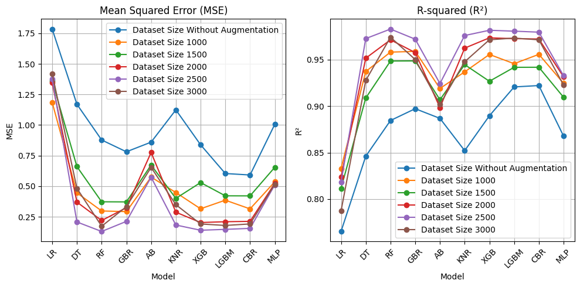
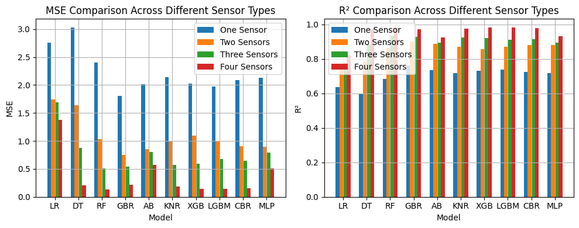
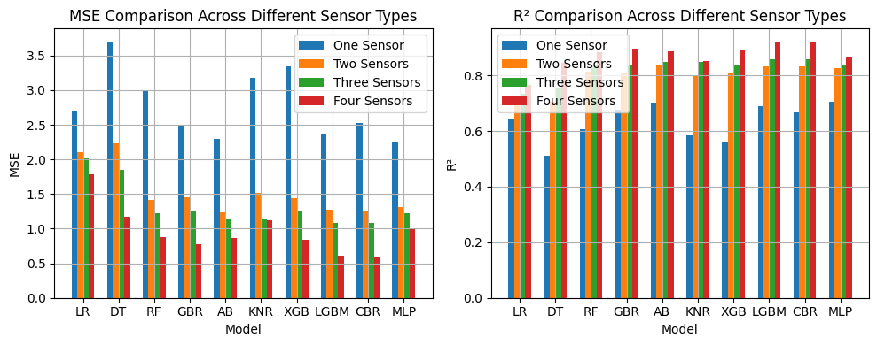
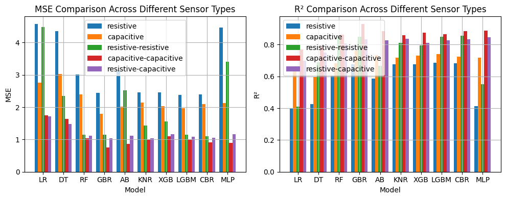
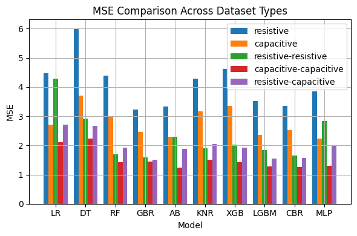
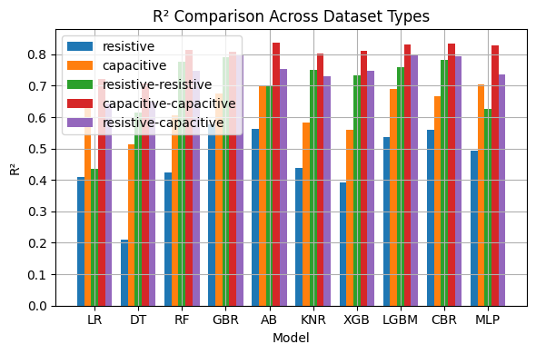

# Performance Comparison of ML Regression Models

This repository presents a series of performance comparisons of Machine Learning (ML) regression models across varying datasets. The following figures display how different regression models perform with varying amounts of data, number of sensors, and sensor types. The evaluation metrics used for these comparisons are **Mean Squared Error (MSE)** and **R-squared (R²)** values. Additionally, the comparison is made between scenarios with and without data augmentation.

---

## Figures Overview

### Figure 7: Performance Comparison of ML Regression Models Across Various Data Volumes

**Caption:**  
Performance comparison of the ML regression models across various data volumes using **MSE (a)** and **R² (b)** values.

---

### Figure 8: Performance Comparison of Regression Models Across Varying Number of Sensors

#### With Augmentation

**Caption:**  
Performance comparison of regression models across varying number of sensors using **MSE (a)** and **R² (b)** values, **with augmentation**.

#### Without Augmentation

**Caption:**  
Performance comparison of regression models across varying number of sensors using **MSE (a)** and **R² (b)** values, **without augmentation**.

---

### Figure 9: Performance Comparison of Regression Models Across Various Sensor Types

#### With Augmentation

**Caption:**  
Performance comparison of regression models across various types of single and combined sensors using **MSE (a)** and **R² (b)** values, **with augmentation**.

#### Without Augmentation (MSE)

**Caption:**  
Performance comparison of regression models across various types of single and combined sensors using **MSE** values, **without augmentation**.

#### Without Augmentation (R²)

**Caption:**  
Performance comparison of regression models across various types of single and combined sensors using **R²** values, **without augmentation**.

---

## Data Analysis and Visualization

Each figure presents detailed insights into the performance of the regression models under different configurations. The MSE and R² values are used to evaluate the models, where:
- **Lower MSE** indicates better performance.
- **Higher R²** indicates better fit of the model to the data.

### Data Augmentation
- **With Augmentation**: Synthetic data or transformations applied to improve model generalization.
- **Without Augmentation**: Original data only, may lead to overfitting if limited.

---

## Files Included

- `Fig-7.png`
- `Fig-8_withaug.png`
- `Fig-8_withoutaug.png`
- `Fig-9_with-aug.png`
- `Fig-9_without-aug-MSE.png`
- `Fig-9_without-aug-R2.png`

---

## License

This project is licensed under the MIT License - see the [LICENSE](LICENSE) file for details.
